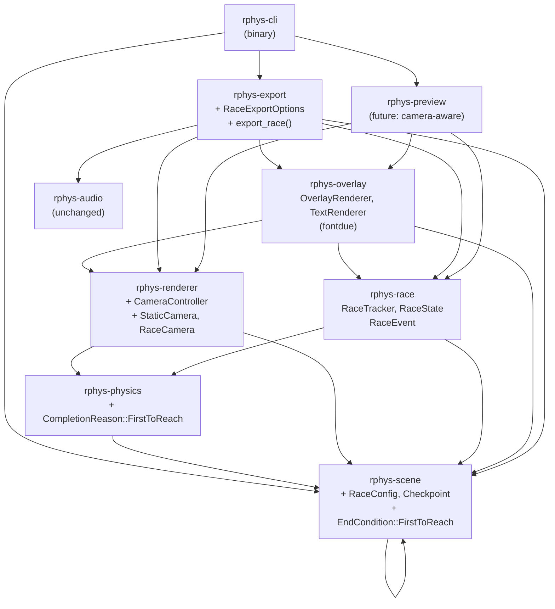

# Sprint 2 — Race Mode Architecture

**Author:** Architect Agent  
**Date:** 2026-03-08  
**Status:** Ready for implementation  
**Scope:** All changes needed to support multi-ball race scenes with dynamic camera, rank overlays, and finish-line detection.

---

## Table of Contents

1. [Overview](#1-overview)
2. [Module Dependency Diagram](#2-module-dependency-diagram)
3. [Scene Format Changes](#3-scene-format-changes)
4. [Camera System](#4-camera-system)
5. [Race State Tracking — `rphys-race`](#5-race-state-tracking--rphys-race)
6. [Overlay Rendering — `rphys-overlay`](#6-overlay-rendering--rphys-overlay)
7. [Export Pipeline Changes](#7-export-pipeline-changes)
8. [Full Rust Type Signatures](#8-full-rust-type-signatures)
9. [Implementation Order](#9-implementation-order)
10. [Key Design Decisions](#10-key-design-decisions)

---

## 1. Overview

A **race scene** has multiple named, colored balls (tagged `"racer"`) that compete to reach a finish line at a target Y coordinate. The rendered video shows:

- A **dynamic camera** that scrolls vertically to follow the leading racer
- A **rank overlay** (rank labels + finish line + checkpoint lines) drawn directly into the `Frame` buffer in Rust, with no second ffmpeg pass
- A **finish line trigger**: the first racer whose Y ≤ `finish_y` wins
- A **winner announcement** displayed on the final held frame (2 s by default)

Everything is rendered in a single ffmpeg pass. Text is rasterized by `fontdue` using an embedded font (`include_bytes!`). Preview mode works identically — the same frame pipeline applies.

### Race direction convention

Physics Y is **up-positive**. Gravity pulls racers **downward** (decreasing Y). The finish line is at a **low Y** value. The camera follows the leading racer (lowest current Y among active racers). This is consistent with the existing world convention and requires no changes to the coordinate system.

---

## 2. Module Dependency Diagram

### New crates

```
rphys-race     — RaceTracker, RaceState, RaceEvent
rphys-overlay  — OverlayRenderer, TextRenderer (fontdue)
```

### Updated crates

```
rphys-scene    — RaceConfig, Checkpoint, EndCondition::FirstToReach
rphys-physics  — CompletionReason::FirstToReach
rphys-renderer — CameraController trait, StaticCamera, RaceCamera
rphys-export   — RaceExportOptions, export() auto-dispatch
rphys-cli      — no interface changes (auto-detects race scenes)
```

### Full dependency graph



**Dependency rule (unchanged):** No lower layer imports an upper layer. `rphys-cli` and `rphys-export` are the only crates allowed to wire everything together.

---

## 3. Scene Format Changes

### 3.1 New `race` section in the YAML

The top-level `Scene` gains an optional `race: Option<RaceConfig>` field. Its presence signals that race mode should be used for both export and preview.

```yaml
race:
  finish_y: 2.0                   # required — world Y where the finish line sits
  racer_tag: "racer"              # optional, default "racer"
  announcement_hold_secs: 2.0     # optional, default 2.0
  checkpoints:                    # optional
    - y: 28.0
      label: "Checkpoint 1"       # optional label rendered in overlay
    - y: 15.0
      label: "Halfway"
```

Racer balls are ordinary `SceneObject` entries. Their **name** is used as the display label and their **color** is used for the rank overlay chip. No special extra fields are needed on the object — just the `"racer"` tag:

```yaml
objects:
  - name: "Red"
    shape: circle
    radius: 0.5
    position: [6.0, 34.0]
    velocity: [0.0, 0.0]
    material:
      restitution: 0.7
      friction: 0.3
      density: 1.0
    color: "#e94560"
    tags: ["racer"]

  - name: "Blue"
    shape: circle
    radius: 0.5
    position: [10.0, 34.0]
    velocity: [0.0, 0.0]
    material:
      restitution: 0.7
      friction: 0.3
      density: 1.0
    color: "#4488ff"
    tags: ["racer"]
```

### 3.2 New `EndCondition` variant: `FirstToReach`

```yaml
end_condition:
  type: first_to_reach
  finish_y: 2.0
  tag: "racer"   # optional, default "racer"
```

This condition fires when **any** body whose tags contain `tag` has a Y position ≤ `finish_y`. The tag field must match the `race.racer_tag` value.

**Composite conditions:** `FirstToReach` can be combined with `Or` (e.g. race completes or time runs out):

```yaml
end_condition:
  type: or
  conditions:
    - type: first_to_reach
      finish_y: 2.0
      tag: "racer"
    - type: time_limit
      seconds: 120.0
```

### 3.3 Changes to `rphys-scene` types

```rust
// ── New: RaceConfig ───────────────────────────────────────────────────────────

/// Configuration for a race scene. Present only if `race:` key exists in YAML.
#[derive(Debug, Clone, PartialEq)]
pub struct RaceConfig {
    /// World Y coordinate of the finish line. Race ends when any racer's
    /// Y ≤ this value.
    pub finish_y: f32,
    /// Tag that identifies racer bodies. Default: `"racer"`.
    pub racer_tag: String,
    /// How long (seconds) to hold the winner frame at the end of export.
    /// Default: 2.0.
    pub announcement_hold_secs: f32,
    /// Optional milestone Y-coordinates shown as horizontal lines with labels.
    pub checkpoints: Vec<Checkpoint>,
}

impl Default for RaceConfig {
    fn default() -> Self {
        Self {
            finish_y: 0.0,
            racer_tag: "racer".to_string(),
            announcement_hold_secs: 2.0,
            checkpoints: Vec::new(),
        }
    }
}

/// A visual checkpoint line at a world Y coordinate.
#[derive(Debug, Clone, PartialEq)]
pub struct Checkpoint {
    /// World Y coordinate of this checkpoint.
    pub y: f32,
    /// Optional label rendered alongside the line in the overlay.
    pub label: Option<String>,
}
```

`Scene` gains:

```rust
pub struct Scene {
    // ... existing fields unchanged ...
    /// Present when the scene is a race. None for non-race scenes.
    pub race: Option<RaceConfig>,
}
```

`EndCondition` gains:

```rust
pub enum EndCondition {
    // ... existing variants unchanged ...

    /// Race condition: fires when the first body tagged with `tag`
    /// crosses below `finish_y`.
    FirstToReach {
        finish_y: f32,
        /// Tag identifying racer bodies. Default when omitted in YAML: `"racer"`.
        tag: String,
    },
}
```

### 3.4 Changes to `rphys-physics` types

`CompletionReason` gains:

```rust
pub enum CompletionReason {
    // ... existing variants unchanged ...

    /// A body with `tag` reached Y ≤ `finish_y`.
    FirstToReach {
        tag: String,
        winner_body: BodyId,
        /// The winner's name, if it had one.
        winner_name: Option<String>,
    },
}
```

The physics engine's end-condition evaluator must check each step whether any tagged body's position.y ≤ finish_y. This check runs alongside existing end-condition evaluators with no other engine changes.

### 3.5 Validation rules added to `rphys-scene`

| Condition | Error |
|---|---|
| `race.finish_y` ≥ maximum Y of any racer's start position | `ValidationError::InvalidValue` ("finish_y must be below racer start positions") |
| Checkpoints not in strictly descending Y order | `ValidationError::InvalidValue` ("checkpoints must be ordered by decreasing y") |
| `end_condition` contains `first_to_reach` but `race` section is absent | `ValidationError::InvalidValue` ("first_to_reach end condition requires a race: section") |
| No objects tagged with `race.racer_tag` | `ValidationError::InvalidValue` ("race scene has no objects tagged 'racer'") |

---

## 4. Camera System

Camera logic lives in **`rphys-renderer`** as a new `camera` module. The camera's job is to produce a fresh `RenderContext` each frame. Since `RenderContext` is already defined in `rphys-renderer` and camera state only needs `PhysicsState` (already a dependency), no new crate is needed.

### 4.1 `CameraController` trait

```rust
/// Produces a RenderContext for each rendered frame.
///
/// Implementations maintain their own state (smoothed position, etc.) and
/// update it on each call.
pub trait CameraController: Send {
    /// Given the latest physics snapshot and elapsed frame time, return the
    /// RenderContext to use for this frame's render call.
    fn update(&mut self, state: &PhysicsState, dt: f32) -> RenderContext;

    /// Reset camera to its initial position (called on scene hot-reload).
    fn reset(&mut self);
}
```

### 4.2 `StaticCamera`

Produces a constant `RenderContext` derived from world bounds. Identical to the existing `build_render_context` behaviour in `rphys-export`.

```rust
/// Fixed camera that always shows the full world bounds.
/// Used for non-race scenes and as a baseline for testing.
pub struct StaticCamera {
    ctx: RenderContext,
}

impl StaticCamera {
    /// Derive scale and origin so the world bounds fill the output exactly.
    pub fn from_scene(scene: &rphys_scene::Scene, width: u32, height: u32) -> Self;

    /// Construct directly from a known RenderContext.
    pub fn new(ctx: RenderContext) -> Self;
}

impl CameraController for StaticCamera {
    fn update(&mut self, _state: &PhysicsState, _dt: f32) -> RenderContext;
    fn reset(&mut self);
}
```

### 4.3 `RaceCameraConfig` and `RaceCamera`

The race camera tracks the **leading racer** — the tagged body with the **lowest current Y** (furthest toward the finish line). It smooth-follows with a configurable damping factor and keeps the leader at a configurable fraction from the bottom of the screen, giving visual "lookahead" into the course ahead.

```rust
/// Tunable parameters for the RaceCamera.
#[derive(Debug, Clone)]
pub struct RaceCameraConfig {
    /// Tag used to identify racer bodies. Should match `RaceConfig::racer_tag`.
    /// Default: `"racer"`.
    pub racer_tag: String,

    /// Where on screen the leading racer appears, as a fraction of screen height
    /// from the BOTTOM. 0.0 = at the very bottom; 1.0 = at the very top.
    /// Default: 0.25 — leader sits 25% up from bottom, leaving 75% lookahead
    /// below.
    pub leader_screen_fraction: f32,

    /// Exponential smoothing factor per second [0.0, 1.0].
    /// Higher = smoother (more lag). Lower = snappier (less lag).
    /// Applied as: origin += (target − origin) × (1 − damping^dt)
    /// Default: 0.92.
    pub damping: f32,

    /// Clamp camera so it never scrolls above this world Y origin.
    /// Prevents revealing empty space above the start of the course.
    /// Default: f32::MAX (no upper clamp).
    pub max_origin_y: f32,

    /// Clamp camera so it never scrolls below this world Y origin.
    /// Prevents revealing empty space below the finish line.
    /// Default: f32::NEG_INFINITY (no lower clamp).
    pub min_origin_y: f32,
}

impl Default for RaceCameraConfig { /* fill in documented defaults */ }

/// Dynamic camera that smooth-follows the race leader.
pub struct RaceCamera {
    config: RaceCameraConfig,
    /// Current (smoothed) camera_origin.y in world space.
    current_origin_y: f32,
    render_width: u32,
    render_height: u32,
    scale: f32,
    background_color: rphys_scene::Color,
}

impl RaceCamera {
    /// Create a race camera. `initial_ctx` provides width, height, scale, and
    /// background color from the scene. The camera_origin is overridden each
    /// frame.
    pub fn new(config: RaceCameraConfig, initial_ctx: RenderContext) -> Self;
}

impl CameraController for RaceCamera {
    /// Locate the leading racer (lowest Y body tagged with `config.racer_tag`),
    /// compute the target camera_origin.y, apply exponential smoothing, clamp,
    /// and return an updated RenderContext.
    ///
    /// If no racer bodies are found (e.g. all finished), the camera holds its
    /// last position.
    fn update(&mut self, state: &PhysicsState, dt: f32) -> RenderContext;
    fn reset(&mut self);
}
```

#### Camera update algorithm (for implementers)

```
let viewport_height_meters = render_height as f32 / scale;
let leader_y = min Y among alive bodies with racer_tag (or current_origin_y if none);
let target_origin_y = leader_y - leader_screen_fraction * viewport_height_meters;
let target_origin_y = clamp(target_origin_y, min_origin_y, max_origin_y);

// Exponential smoothing:
let alpha = 1.0 - damping.powf(dt);
current_origin_y += (target_origin_y - current_origin_y) * alpha;

return RenderContext {
    width: render_width,
    height: render_height,
    camera_origin: Vec2::new(0.0, current_origin_y),
    scale,
    background_color,
};
```

### 4.4 `CameraController` in the render loop

Replace the static `ctx` construction in `export()` and `preview` with a `Box<dyn CameraController>`. On each frame:

```rust
let ctx = camera.update(engine.state_ref(), frame_dt);
let frame = renderer.render(&state, &ctx);
```

`StaticCamera` is used for non-race scenes (identical behaviour to current code).  
`RaceCamera` is used when `scene.race.is_some()`.

---

## 5. Race State Tracking — `rphys-race`

### Responsibility

Own the race-specific simulation layer: wrap `PhysicsEngine`, maintain per-racer rankings, detect checkpoint crossings, and emit `RaceEvent`s alongside the standard `PhysicsEvent`s.

### Crate location

`crates/rphys-race/`

### Dependencies

- `rphys-physics`, `rphys-scene`
- `thiserror`

### 5.1 Core types

```rust
use rphys_physics::{BodyId, PhysicsState};
use rphys_scene::Color;

/// Snapshot of the race standings at a point in time.
///
/// Cloneable so the overlay renderer can hold the most recent copy.
#[derive(Debug, Clone)]
pub struct RaceState {
    /// All active (not yet finished) racers, sorted by current rank (index 0 =
    /// leading). Rank is determined by Y position: lower Y = further along =
    /// better rank.
    pub active: Vec<RacerStatus>,

    /// Racers who have crossed the finish line, sorted by finish order.
    pub finished: Vec<FinishedEntry>,

    /// Set to Some once the first racer finishes.
    pub winner: Option<WinnerInfo>,

    /// Elapsed simulation time in seconds when this snapshot was taken.
    pub elapsed_secs: f32,
}

/// Live status of one active (racing) racer.
#[derive(Debug, Clone)]
pub struct RacerStatus {
    pub body_id: BodyId,
    /// The racer's display name (from `SceneObject::name`). Falls back to
    /// `"Racer {id}"` if unnamed.
    pub display_name: String,
    /// The racer's color from the scene object.
    pub color: Color,
    /// Current rank among active racers (1-based). Determined by Y position.
    pub rank: usize,
    /// Current world Y position.
    pub position_y: f32,
    /// Index of the last checkpoint this racer has crossed (0-based into
    /// `RaceConfig::checkpoints`). None if no checkpoint crossed yet.
    pub last_checkpoint: Option<usize>,
}

/// A racer who has crossed the finish line.
#[derive(Debug, Clone)]
pub struct FinishedEntry {
    pub body_id: BodyId,
    pub display_name: String,
    pub color: Color,
    /// Final rank in the race (1 = winner, 2 = runner-up, ...).
    pub finish_rank: usize,
    /// Simulation time when they crossed the finish line (seconds).
    pub finish_time_secs: f32,
}

/// Winner information used by the overlay for the announcement.
#[derive(Debug, Clone)]
pub struct WinnerInfo {
    pub body_id: BodyId,
    pub display_name: String,
    pub color: Color,
    pub finish_time_secs: f32,
}
```

### 5.2 Race events

```rust
/// Events emitted by `RaceTracker` in addition to standard `PhysicsEvent`s.
#[derive(Debug, Clone)]
pub enum RaceEvent {
    /// The leaderboard order changed (at least one rank swap occurred this step).
    RankChanged {
        /// New rankings snapshot after the change.
        new_rankings: Vec<(BodyId, usize)>,  // (body_id, rank)
    },

    /// A racer crossed a checkpoint for the first time.
    CheckpointCrossed {
        body_id: BodyId,
        display_name: String,
        checkpoint_index: usize,
        checkpoint_y: f32,
        /// Racer's rank at the moment of crossing.
        rank_at_crossing: usize,
    },

    /// A racer's leading edge reached or passed the finish line.
    RacerFinished {
        body_id: BodyId,
        display_name: String,
        finish_rank: usize,
        finish_time_secs: f32,
    },

    /// The race is complete (first racer has finished).
    RaceComplete {
        winner: WinnerInfo,
    },
}
```

### 5.3 `RaceTracker`

`RaceTracker` **owns** the `PhysicsEngine` and delegates simulation. Callers interact with `RaceTracker` instead of `PhysicsEngine` directly for race scenes.

```rust
pub struct RaceTracker {
    // private
}

impl RaceTracker {
    /// Build a race tracker from a scene that must contain a `race` config.
    ///
    /// Returns `RaceError::NoRaceConfig` if `scene.race` is None.
    pub fn new(
        scene: &rphys_scene::Scene,
        config: rphys_physics::PhysicsConfig,
    ) -> Result<Self, RaceError>;

    // ── Simulation ────────────────────────────────────────────────────────────

    /// Advance one fixed physics timestep.
    /// Returns both the standard physics events and any race events from this
    /// step.
    pub fn step(
        &mut self,
    ) -> Result<(Vec<rphys_physics::PhysicsEvent>, Vec<RaceEvent>), RaceError>;

    /// Advance until `target_time` is reached, accumulating all events.
    pub fn advance_to(
        &mut self,
        target_time: f32,
    ) -> Result<(Vec<rphys_physics::PhysicsEvent>, Vec<RaceEvent>), RaceError>;

    // ── State access ──────────────────────────────────────────────────────────

    /// Snapshot the physics world for rendering.
    pub fn physics_state(&self) -> rphys_physics::PhysicsState;

    /// Current race standings snapshot.
    pub fn race_state(&self) -> &RaceState;

    /// Current physics time in seconds.
    pub fn time(&self) -> f32;

    /// True after `SimulationComplete` has been emitted by the physics engine.
    pub fn is_physics_complete(&self) -> bool;

    /// True after the first racer has crossed the finish line.
    pub fn is_race_complete(&self) -> bool;

    /// Borrow the inner PhysicsEngine (for body_info lookups, etc.).
    pub fn engine(&self) -> &rphys_physics::PhysicsEngine;
}
```

### 5.4 Ranking algorithm

Run after every physics step, inside `RaceTracker::step()`:

1. Collect all bodies whose tags contain `race_config.racer_tag` and that are alive and not yet in `finished`.
2. Sort by `position_y` ascending (lower = further along).
3. Assign `rank` 1..N.
4. Compare against previous rankings; if any rank changed, emit `RaceEvent::RankChanged`.

Checkpoint detection (also per step):

1. For each active racer, iterate checkpoints in order (they are sorted by descending Y).
2. If `racer.position_y ≤ checkpoint.y` and the racer's `last_checkpoint` index is less than this checkpoint's index → emit `RaceEvent::CheckpointCrossed` and update `last_checkpoint`.

Finish detection:

1. For each active racer: if `racer.position_y ≤ race_config.finish_y` → emit `RaceEvent::RacerFinished`, move from `active` to `finished`.
2. If this is the first finisher → emit `RaceEvent::RaceComplete` and set `winner`.

**Note:** `RaceTracker` performs finish detection independently of the physics engine's `EndCondition::FirstToReach`. The physics `end_condition` stops the simulation loop; `RaceTracker`'s finish detection provides the race-specific events. Both should fire at approximately the same time, but `RaceTracker` is authoritative for race metadata.

### 5.5 Error type

```rust
#[derive(Debug, thiserror::Error)]
pub enum RaceError {
    #[error("Scene has no race configuration (missing 'race:' section)")]
    NoRaceConfig,

    #[error("Physics error: {0}")]
    Physics(#[from] rphys_physics::PhysicsError),
}
```

---

## 6. Overlay Rendering — `rphys-overlay`

### Responsibility

Draw race-specific UI directly into a `Frame` buffer:
- Rank leaderboard panel (screen-space, top-right corner)
- Finish line and checkpoint lines (world-space, scrolling with the camera)
- Winner announcement panel (screen-space, full-frame overlay on final frames)

Text is rasterized with **`fontdue`** using a bundled font embedded via `include_bytes!`.

### Crate location

`crates/rphys-overlay/`

### Dependencies

- `rphys-renderer` (for `Frame`, `RenderContext`)
- `rphys-race` (for `RaceState`, `WinnerInfo`)
- `rphys-scene` (for `Color`, `Vec2`)
- `fontdue` — pure-Rust TrueType rasteriser
- `thiserror`

### 6.1 Font embedding

Bundle a single **Roboto Bold** TTF (or Inter Bold TTF — both OFL-licensed) in `rphys-overlay/assets/`:

```rust
// In rphys-overlay/src/lib.rs or text.rs
const BUNDLED_FONT: &[u8] = include_bytes!("../assets/Roboto-Bold.ttf");
```

The font file should be committed to the repository under `crates/rphys-overlay/assets/`. At ~170 KB it is acceptable as a compiled-in resource. A build script is not required — `include_bytes!` handles this at compile time.

### 6.2 `TextRenderer`

Internal component used by `OverlayRenderer`. Not exposed as public API.

```rust
/// Rasterises glyphs from the bundled font and composites them into a Frame.
struct TextRenderer {
    font: fontdue::Font,
}

impl TextRenderer {
    fn new() -> Self;

    /// Rasterise `text` at `size` px and composite it (alpha-blend) into `frame`
    /// with the top-left corner at pixel `(x, y)`.
    ///
    /// `color` is the text foreground color (RGBA). The glyph coverage mask is
    /// used as the alpha channel for blending.
    fn draw_text(
        &self,
        frame: &mut rphys_renderer::Frame,
        text: &str,
        size: f32,
        x: i32,
        y: i32,
        color: rphys_scene::Color,
    );

    /// Measure the bounding box of `text` at `size` px without drawing it.
    /// Returns `(width, height)` in pixels.
    fn measure(&self, text: &str, size: f32) -> (u32, u32);
}
```

**Compositing rule:** standard alpha-over blending (premultiplied not required since Frame is straight RGBA):
```
out.r = src.r * src.a/255 + dst.r * (1 - src.a/255)
```
Clamp all channels to [0, 255].

### 6.3 `OverlayRenderer`

```rust
/// Draws race UI elements directly into a Frame buffer.
///
/// Create once; reuse across frames. Not Clone — owns the font.
pub struct OverlayRenderer {
    text: TextRenderer,   // private
}

impl OverlayRenderer {
    /// Construct a new overlay renderer, loading the bundled font.
    ///
    /// This is cheap to call (font is embedded, no IO).
    pub fn new() -> Self;

    /// Draw the full race overlay for a normal (in-progress) frame:
    ///
    /// 1. Finish line — horizontal line at `race_config.finish_y` in world space
    /// 2. Checkpoint lines — horizontal lines at each checkpoint Y
    /// 3. Rank panel — top-right leaderboard showing current order
    ///
    /// `ctx` is used for world→pixel coordinate transforms. The finish line and
    /// checkpoint lines may be off-screen if the camera has not scrolled to them
    /// yet — callers do not need to filter.
    pub fn draw_race_frame(
        &self,
        frame: &mut rphys_renderer::Frame,
        race_state: &rphys_race::RaceState,
        race_config: &rphys_scene::RaceConfig,
        ctx: &rphys_renderer::RenderContext,
    ) -> Result<(), OverlayError>;

    /// Draw the winner announcement overlay for the final held frames.
    ///
    /// Draws a semi-transparent dark panel in the lower half of the frame with:
    /// - A large trophy emoji + winner name in their color
    /// - Finish times for all finishers (if multiple racers)
    ///
    /// This is composited ON TOP of the final physics frame. Call after
    /// `draw_race_frame` for the last rendered frame.
    pub fn draw_winner_announcement(
        &self,
        frame: &mut rphys_renderer::Frame,
        race_state: &rphys_race::RaceState,
    ) -> Result<(), OverlayError>;
}
```

### 6.4 Visual specifications for implementers

#### Rank panel (top-right corner)

- Background: `rgba(0, 0, 0, 160)` rounded rect, 8 px padding, right-aligned, width ~280 px
- Per racer row (top-down, sorted by current rank):
  - Colored circle (racer color), 18 px diameter
  - Rank medal text: `"🥇"`, `"🥈"`, `"🥉"`, `"4."`, `"5."`, ... at 28 px
  - Racer name at 26 px, color matches racer
  - Finished racers: dimmed + finish time appended, e.g. `"Red  12.3s"`
- Margin from top-right corner: 16 px

#### Finish line

- Dashed horizontal line across the full frame width
- Color: `rgba(255, 215, 0, 220)` (gold)
- Line thickness: 3 px
- Label: `"FINISH"` in 32 px text, gold, positioned 8 px above the line, centered

#### Checkpoint lines

- Solid horizontal line, 2 px thick
- Color: `rgba(255, 255, 255, 120)` (translucent white)
- Label: checkpoint label (if set) in 22 px text, right-aligned, 8 px above the line

#### Winner announcement panel

- Dark semi-transparent full-width panel in the lower 40% of the frame
  - Background: `rgba(0, 0, 0, 210)`
- Large text centered:
  - Line 1: `"🏆 [WINNER NAME]"` at 72 px, in the winner's color
  - Line 2: `"Finished in [X.XX]s"` at 36 px, white
  - Lines 3+: `"🥈 [Name] — [X.XX]s"` etc., 28 px, each in their color

### 6.5 Error type

```rust
#[derive(Debug, thiserror::Error)]
pub enum OverlayError {
    #[error("Failed to rasterise text: {0}")]
    Rasterize(String),
}
```

In practice this should rarely fire (no IO, no dynamic font loading). `draw_race_frame` and `draw_winner_announcement` must not panic on out-of-bounds text positions — clip to frame edges silently.

---

## 7. Export Pipeline Changes

### 7.1 `RaceExportOptions`

```rust
/// Export options specific to race scenes.
///
/// Wraps `ExportOptions` and adds race-specific tuning.
#[derive(Debug, Clone)]
pub struct RaceExportOptions {
    /// Base export options (resolution, fps, output path).
    pub base: ExportOptions,

    /// Camera configuration. If None, sensible defaults are derived from the
    /// scene's world_bounds.
    pub camera: Option<rphys_renderer::RaceCameraConfig>,

    /// Whether to render the rank overlay and finish/checkpoint lines.
    /// Default: true.
    pub overlay_enabled: bool,

    /// Override for how many seconds to hold the winner frame.
    /// Default: taken from `scene.race.announcement_hold_secs` (2.0 s).
    pub winner_hold_secs_override: Option<f32>,
}

impl RaceExportOptions {
    /// Build race export options from a preset with overlay enabled and
    /// default camera settings.
    pub fn from_preset(
        preset: rphys_export::Preset,
        output_path: std::path::PathBuf,
    ) -> Self;
}
```

### 7.2 `export()` auto-dispatch

The existing public `export()` function signature is **unchanged**. It gains internal dispatch:

```rust
pub fn export(scene: &Scene, options: ExportOptions) -> Result<(), ExportError> {
    if scene.race.is_some() {
        // Auto-build race options with defaults derived from ExportOptions.
        let race_opts = RaceExportOptions {
            base: options,
            camera: None,       // use defaults
            overlay_enabled: true,
            winner_hold_secs_override: None,
        };
        export_race_internal(scene, race_opts)
    } else {
        export_standard_internal(scene, options)
    }
}
```

`export_standard_internal` is the current logic extracted into a private function. No behaviour change for non-race scenes.

### 7.3 `export_race_internal` pipeline

```rust
fn export_race_internal(scene: &Scene, options: RaceExportOptions) -> Result<(), ExportError>;
```

Internal frame loop (pseudocode for implementers):

```
let race_config = scene.race.as_ref().unwrap();
let winner_hold_secs = options.winner_hold_secs_override
    .unwrap_or(race_config.announcement_hold_secs);

// ── Setup ─────────────────────────────────────────────────────────────
let physics_cfg = PhysicsConfig { max_steps_per_call: u32::MAX, ..default() };
let mut tracker  = RaceTracker::new(scene, physics_cfg)?;
let mut renderer = TinySkiaRenderer;
let mut audio    = OfflineAudioMixer::new(44100, 2);

let initial_ctx  = build_initial_render_context(&options.base, scene);
let camera_cfg   = options.camera.unwrap_or_else(|| default_race_camera_cfg(race_config));
let mut camera   = RaceCamera::new(camera_cfg, initial_ctx);
let overlay      = OverlayRenderer::new();   // if options.overlay_enabled

let max_duration = resolve_max_duration(scene, &options.base)?;

let mut ffmpeg = spawn_ffmpeg_video_only(&options.base)?;
let mut ffmpeg_stdin = ffmpeg.stdin.take()...;

// ── Main race loop ─────────────────────────────────────────────────────
let mut frame_count = 0u64;

loop {
    let target_time = (frame_count + 1) as f32 / options.base.fps as f32;
    let frame_dt    = 1.0 / options.base.fps as f32;

    let (physics_events, _race_events) = tracker.advance_to(target_time)?;

    for event in &physics_events {
        collect_audio_event(&mut audio, tracker.engine(), event, tracker.time(), scene);
    }

    let phys_state = tracker.physics_state();
    let ctx        = camera.update(&phys_state, frame_dt);
    let mut frame  = renderer.render(&phys_state, &ctx);

    if options.overlay_enabled {
        overlay.draw_race_frame(&mut frame, tracker.race_state(), race_config, &ctx)?;
    }

    ffmpeg_stdin.write_all(&frame.pixels)?;
    frame_count += 1;

    if tracker.is_physics_complete() || target_time >= max_duration {
        break;
    }
}

// ── Winner announcement hold ───────────────────────────────────────────
// Render one final "winner" frame and duplicate it for hold duration.
let hold_frames = (winner_hold_secs * options.base.fps as f32).round() as u64;

if hold_frames > 0 && tracker.race_state().winner.is_some() {
    let phys_state = tracker.physics_state();
    // Camera stays at its last position (no more update needed).
    let last_ctx   = camera.update(&phys_state, 0.0);
    let mut frame  = renderer.render(&phys_state, &last_ctx);

    if options.overlay_enabled {
        overlay.draw_race_frame(&mut frame, tracker.race_state(), race_config, &last_ctx)?;
        overlay.draw_winner_announcement(&mut frame, tracker.race_state())?;
    }

    // Write the same frame hold_frames times.
    for _ in 0..hold_frames {
        ffmpeg_stdin.write_all(&frame.pixels)?;
        frame_count += 1;
    }
}

// ── Finalise ───────────────────────────────────────────────────────────
drop(ffmpeg_stdin);
ffmpeg.wait()...;

// Audio mux pass (unchanged from current export logic).
```

### 7.4 `max_duration` for race scenes

`resolve_max_duration` is extended to recognise `EndCondition::FirstToReach` — it does **not** provide a numeric duration (unlike `TimeLimit`). In this case, fall through to `scene.meta.duration_hint` or `options.max_duration`. Scene authors should always include a `time_limit` fallback in an `or` condition or set `duration_hint` as a safety cap:

```yaml
end_condition:
  type: or
  conditions:
    - type: first_to_reach
      finish_y: 2.0
    - type: time_limit
      seconds: 120.0    # safety cap
```

---

## 8. Full Rust Type Signatures

This section consolidates every new public type. No implementation — API surface only.

### 8.1 `rphys-scene` additions

```rust
// In rphys_scene::types

#[derive(Debug, Clone, PartialEq, serde::Deserialize)]
pub struct RaceConfig {
    pub finish_y: f32,
    #[serde(default = "default_racer_tag")]
    pub racer_tag: String,
    #[serde(default = "default_announcement_hold")]
    pub announcement_hold_secs: f32,
    #[serde(default)]
    pub checkpoints: Vec<Checkpoint>,
}

#[derive(Debug, Clone, PartialEq, serde::Deserialize)]
pub struct Checkpoint {
    pub y: f32,
    pub label: Option<String>,
}

// EndCondition gains:
pub enum EndCondition {
    // ... existing variants ...
    FirstToReach {
        finish_y: f32,
        #[serde(default = "default_racer_tag")]
        tag: String,
    },
}

// Scene gains:
pub struct Scene {
    // ... existing fields ...
    pub race: Option<RaceConfig>,
}
```

### 8.2 `rphys-physics` additions

```rust
// CompletionReason gains:
pub enum CompletionReason {
    // ... existing variants ...
    FirstToReach {
        tag: String,
        winner_body: BodyId,
        winner_name: Option<String>,
    },
}
```

### 8.3 `rphys-renderer` additions (`camera` module)

```rust
// rphys_renderer::camera

pub trait CameraController: Send {
    fn update(&mut self, state: &rphys_physics::PhysicsState, dt: f32) -> RenderContext;
    fn reset(&mut self);
}

pub struct StaticCamera { /* private */ }
impl StaticCamera {
    pub fn from_scene(scene: &rphys_scene::Scene, width: u32, height: u32) -> Self;
    pub fn new(ctx: RenderContext) -> Self;
}
impl CameraController for StaticCamera { /* ... */ }

#[derive(Debug, Clone)]
pub struct RaceCameraConfig {
    pub racer_tag: String,
    pub leader_screen_fraction: f32,
    pub damping: f32,
    pub max_origin_y: f32,
    pub min_origin_y: f32,
}
impl Default for RaceCameraConfig { /* documented defaults */ }

pub struct RaceCamera { /* private */ }
impl RaceCamera {
    pub fn new(config: RaceCameraConfig, initial_ctx: RenderContext) -> Self;
}
impl CameraController for RaceCamera { /* ... */ }
```

### 8.4 `rphys-race` (new crate)

```rust
// rphys_race::types

#[derive(Debug, Clone)]
pub struct RaceState {
    pub active: Vec<RacerStatus>,
    pub finished: Vec<FinishedEntry>,
    pub winner: Option<WinnerInfo>,
    pub elapsed_secs: f32,
}

#[derive(Debug, Clone)]
pub struct RacerStatus {
    pub body_id: rphys_physics::BodyId,
    pub display_name: String,
    pub color: rphys_scene::Color,
    pub rank: usize,
    pub position_y: f32,
    pub last_checkpoint: Option<usize>,
}

#[derive(Debug, Clone)]
pub struct FinishedEntry {
    pub body_id: rphys_physics::BodyId,
    pub display_name: String,
    pub color: rphys_scene::Color,
    pub finish_rank: usize,
    pub finish_time_secs: f32,
}

#[derive(Debug, Clone)]
pub struct WinnerInfo {
    pub body_id: rphys_physics::BodyId,
    pub display_name: String,
    pub color: rphys_scene::Color,
    pub finish_time_secs: f32,
}

#[derive(Debug, Clone)]
pub enum RaceEvent {
    RankChanged {
        new_rankings: Vec<(rphys_physics::BodyId, usize)>,
    },
    CheckpointCrossed {
        body_id: rphys_physics::BodyId,
        display_name: String,
        checkpoint_index: usize,
        checkpoint_y: f32,
        rank_at_crossing: usize,
    },
    RacerFinished {
        body_id: rphys_physics::BodyId,
        display_name: String,
        finish_rank: usize,
        finish_time_secs: f32,
    },
    RaceComplete {
        winner: WinnerInfo,
    },
}

// rphys_race::tracker

pub struct RaceTracker { /* private */ }

impl RaceTracker {
    pub fn new(
        scene: &rphys_scene::Scene,
        config: rphys_physics::PhysicsConfig,
    ) -> Result<Self, RaceError>;

    pub fn step(
        &mut self,
    ) -> Result<(Vec<rphys_physics::PhysicsEvent>, Vec<RaceEvent>), RaceError>;

    pub fn advance_to(
        &mut self,
        target_time: f32,
    ) -> Result<(Vec<rphys_physics::PhysicsEvent>, Vec<RaceEvent>), RaceError>;

    pub fn physics_state(&self) -> rphys_physics::PhysicsState;
    pub fn race_state(&self) -> &RaceState;
    pub fn engine(&self) -> &rphys_physics::PhysicsEngine;
    pub fn time(&self) -> f32;
    pub fn is_physics_complete(&self) -> bool;
    pub fn is_race_complete(&self) -> bool;
}

// rphys_race::error

#[derive(Debug, thiserror::Error)]
pub enum RaceError {
    #[error("Scene has no race configuration (missing 'race:' section)")]
    NoRaceConfig,

    #[error("Physics error: {0}")]
    Physics(#[from] rphys_physics::PhysicsError),
}
```

### 8.5 `rphys-overlay` (new crate)

```rust
// rphys_overlay::overlay

pub struct OverlayRenderer { /* private, owns TextRenderer */ }

impl OverlayRenderer {
    pub fn new() -> Self;

    pub fn draw_race_frame(
        &self,
        frame: &mut rphys_renderer::Frame,
        race_state: &rphys_race::RaceState,
        race_config: &rphys_scene::RaceConfig,
        ctx: &rphys_renderer::RenderContext,
    ) -> Result<(), OverlayError>;

    pub fn draw_winner_announcement(
        &self,
        frame: &mut rphys_renderer::Frame,
        race_state: &rphys_race::RaceState,
    ) -> Result<(), OverlayError>;
}

impl Default for OverlayRenderer {
    fn default() -> Self { Self::new() }
}

// rphys_overlay::error

#[derive(Debug, thiserror::Error)]
pub enum OverlayError {
    #[error("Text rasterization failed: {0}")]
    Rasterize(String),
}
```

### 8.6 `rphys-export` additions

```rust
// rphys_export::race (new module, private)

#[derive(Debug, Clone)]
pub struct RaceExportOptions {
    pub base: ExportOptions,
    pub camera: Option<rphys_renderer::RaceCameraConfig>,
    pub overlay_enabled: bool,
    pub winner_hold_secs_override: Option<f32>,
}

impl RaceExportOptions {
    pub fn from_preset(preset: Preset, output_path: std::path::PathBuf) -> Self;
}

// ExportError gains:
#[derive(Debug, thiserror::Error)]
pub enum ExportError {
    // ... existing variants ...
    #[error("Race error: {0}")]
    Race(#[from] rphys_race::RaceError),

    #[error("Overlay error: {0}")]
    Overlay(#[from] rphys_overlay::OverlayError),
}
```

### 8.7 Cargo.toml additions

```toml
# workspace Cargo.toml — add new members
[workspace]
members = [
    # ... existing members ...
    "crates/rphys-race",
    "crates/rphys-overlay",
]

[workspace.dependencies]
# ... existing deps ...
fontdue = "0.9"   # verify latest on crates.io before use
```

```toml
# crates/rphys-race/Cargo.toml
[dependencies]
rphys-scene   = { path = "../rphys-scene" }
rphys-physics = { path = "../rphys-physics" }
thiserror     = { workspace = true }

# crates/rphys-overlay/Cargo.toml
[dependencies]
rphys-renderer = { path = "../rphys-renderer" }
rphys-race     = { path = "../rphys-race" }
rphys-scene    = { path = "../rphys-scene" }
fontdue        = { workspace = true }
thiserror      = { workspace = true }

# crates/rphys-export/Cargo.toml — add
rphys-race    = { path = "../rphys-race" }
rphys-overlay = { path = "../rphys-overlay" }
```

---

## 9. Implementation Order

The dependency graph determines the safe build order. Items at the same level can be implemented **in parallel**.

```
Wave 1 (no new deps) — can start immediately, in parallel:
  ├── rphys-scene: add RaceConfig, Checkpoint, EndCondition::FirstToReach
  └── rphys-physics: add CompletionReason::FirstToReach + evaluator

Wave 2 (depends on Wave 1):
  ├── rphys-renderer: add CameraController trait, StaticCamera, RaceCamera
  └── rphys-race: full RaceTracker implementation

Wave 3 (depends on Wave 2):
  └── rphys-overlay: TextRenderer + OverlayRenderer (depends on rphys-renderer + rphys-race)

Wave 4 (depends on Wave 3):
  └── rphys-export: RaceExportOptions, export_race_internal, auto-dispatch in export()

Wave 5 (depends on Wave 4):
  └── rphys-cli: no interface changes; smoke-test with a race.yaml example scene
```

### Suggested agent assignments

| Wave | Crate(s) | Complexity | Notes |
|---|---|---|---|
| 1a | `rphys-scene` | Low | Pure data struct + YAML deserialization + validation rules |
| 1b | `rphys-physics` | Low | Add one enum variant + one evaluator branch |
| 2a | `rphys-renderer` | Medium | New module `camera.rs`; update `build_render_context` call sites |
| 2b | `rphys-race` | Medium | New crate; core logic, careful ranking algorithm |
| 3 | `rphys-overlay` | High | Font rasterization, pixel blitting, visual polish |
| 4 | `rphys-export` | Medium | Refactor existing export loop; add race variant |
| 5 | `rphys-cli` | Low | Test + example scene; add `race.yaml` to `examples/` |

---

## 10. Key Design Decisions

### D1 — Text rendered in Rust, not ffmpeg drawtext

**Decision:** All overlays are drawn into the `Frame` buffer by `OverlayRenderer` using `fontdue`. No second ffmpeg pass.

**Rationale:**
- Works identically in preview (live window) and export (video) modes — one code path.
- No ffmpeg filter complexity. No timestamp-syncing between two passes.
- The `Frame` buffer is already the canonical rendered output; compositing there is natural.
- `fontdue` is pure Rust, zero system dependencies, ~50KB.
- Slightly higher CPU cost per frame is negligible given tiny-skia's CPU baseline.

**Trade-off:** Text quality is limited by the font and `fontdue`'s rasterizer. For MVP this is acceptable; GPU-accelerated text (via a future wgpu renderer) can replace it without changing the overlay API.

---

### D2 — Camera logic lives in `rphys-renderer`, not a new `rphys-camera` crate

**Decision:** `CameraController` trait and both implementations are in `rphys-renderer`.

**Rationale:**
- `RenderContext` (the camera's output) is already in `rphys-renderer`.
- `rphys-renderer` already depends on `rphys-physics` (for `PhysicsState`) — no new dependency edges.
- A dedicated `rphys-camera` crate would be a thin layer with no unique dependencies, adding workspace overhead for minimal benefit.

---

### D3 — `RaceTracker` wraps `PhysicsEngine`

**Decision:** `RaceTracker` owns a `PhysicsEngine` rather than borrowing or sitting beside it.

**Rationale:**
- Callers of `RaceTracker` only need one object to advance the simulation AND get race state. Avoids borrow-checker complexity in the export loop.
- `RaceTracker` intercepts every `step()` and `advance_to()` call to update rankings, which requires coordinated access.
- Access to the inner `PhysicsEngine` (for `body_info` lookups) is exposed via `tracker.engine()` — still available when needed.

---

### D4 — Ranking by Y position only (no checkpoint-based ranking)

**Decision:** Active racers are ranked solely by their current world Y position (lower = further = better rank). Checkpoints are milestones/markers only.

**Rationale:**
- Simple, deterministic, O(n log n) per step.
- Checkpoints could introduce anomalies: a racer who crosses checkpoint 2 then bounces back before checkpoint 3 would appear ahead of a racer still approaching checkpoint 2 even though they're physically behind. Y position avoids this.
- Checkpoint events are still emitted for overlay display ("Red crossed Halfway!") — they just don't affect ranking.

---

### D5 — `export()` auto-dispatches based on `scene.race.is_some()`

**Decision:** The public `export()` signature is unchanged. It internally routes to `export_race_internal` when the scene has a race config.

**Rationale:**
- CLI and preview callers need no changes. A race scene "just works".
- Clean feature boundary: race logic is fully contained within the internal `export_race_internal` path.
- `RaceExportOptions` is available for callers who need fine-grained control (via a future public `export_race()` entry point if needed).

---

### D6 — Winner hold by duplicate frames, not ffmpeg `-loop`

**Decision:** The winner announcement is shown by writing the same rendered frame `fps × hold_secs` times into the ffmpeg pipe.

**Rationale:**
- Consistent with the single-pass pipe architecture. No special ffmpeg flags or filter graphs.
- The winner frame has the overlay drawn into it by `OverlayRenderer` — the same pixel data is valid to repeat N times.
- Progress reporting (`on_frame`) still works naturally across the hold period.

---

### D7 — Font bundled via `include_bytes!` in `rphys-overlay`

**Decision:** One open-source sans-serif font (Roboto Bold or Inter Bold) is embedded at compile time.

**Rationale:**
- No system font dependency (works on all platforms including CI, Docker, headless servers).
- Deterministic rendering — the same font file always produces the same pixels.
- Font file (~170 KB) adds negligible binary size overhead for a CLI tool.
- `fontdue` handles TrueType rasterization without a native freetype dependency.

**Note for implementers:** Download `Roboto-Bold.ttf` from [Google Fonts](https://fonts.google.com/specimen/Roboto) (OFL license) or `Inter-Bold.ttf` from [rsms.me/inter](https://rsms.me/inter) (OFL license). Place in `crates/rphys-overlay/assets/`. Commit to the repo.

---

## Open Questions

1. **Preview camera integration:** `rphys-preview` currently has a placeholder implementation (`lib.rs` is empty). When preview is implemented, it should use `Box<dyn CameraController>` in its event loop — this design supports it without changes. *(No blocking issue for Sprint 2.)*

2. **Emoji rendering with fontdue:** `fontdue` rasterises TrueType text but does not support color emoji (CBDT/CPAL). The medal glyphs `🥇🥈🥉🏆` will render as outlines-only (grey/black). Acceptable for MVP. If full emoji color is needed, the implementer should substitute text fallbacks (`"1."`, `"2."`, `"3."`, `"Win!"`) and document this as a known limitation.

3. **Racer collision audio:** When two racers collide, `PhysicsEvent::Collision` fires. The `collect_audio_event` function uses `body_a`'s bounce sound. For multi-racer scenes, authors should set a consistent `audio.default_bounce` rather than per-object sounds to avoid one racer going silent in collisions.

4. **Race scenes with more than 8 racers:** The rank panel height scales with racer count. For very large races (8+), the panel may overflow. The overlay renderer should cap display at 8 entries and show `"+ N more"` as a fallback. Not required for MVP but good to note.
