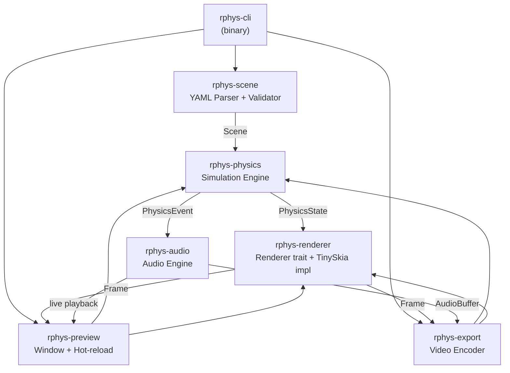

# System Overview — rphys-renderer

## Purpose

`rphys` is a CLI tool that reads a declarative YAML scene file and either:
- **`preview`** — opens a live window showing the physics simulation in real time, with hot-reload on file save
- **`render`** — runs the simulation headlessly, encodes each frame, and writes a finished MP4

Target output: vertical short-form video (TikTok / YouTube Shorts) — visually satisfying, deterministic, reproducible.

---

## Workspace Layout

```
rphys-renderer/
├── Cargo.toml              ← workspace root
├── crates/
│   ├── rphys-cli/          ← binary (main.rs, clap definitions)
│   ├── rphys-scene/        ← YAML parsing + validation + schema
│   ├── rphys-physics/      ← rapier2d wrapper, simulation loop, events
│   ├── rphys-renderer/     ← Renderer trait + tiny-skia implementation
│   ├── rphys-audio/        ← event-driven audio (rodio + offline mixer)
│   ├── rphys-preview/      ← winit window + notify file watcher
│   └── rphys-export/       ← frame pipeline → ffmpeg → MP4
├── assets/
│   └── sounds/             ← bundled CC0 sound effects
├── examples/               ← .yaml scene files
├── schemas/
│   └── scene.schema.json   ← generated JSON Schema
└── docs/
    └── architecture/       ← this directory
```

---

## High-Level Module Diagram



**Dependency rule:** data flows downward / rightward. Lower layers never import upper layers. `rphys-cli` is the only crate allowed to wire everything together.

---

## Data Flow: Preview Mode

```
rphys preview scene.yaml
        │
        ▼
  [rphys-scene]  parse & validate YAML
        │  Scene
        ▼
  [rphys-preview]  create window (winit), start file watcher (notify)
        │
        ▼  ┌──────────── hot-reload loop ────────────────────────────────┐
  [rphys-physics]  PhysicsEngine::new(&scene)                            │
        │                                                                  │
        ▼  ┌──── fixed-timestep simulation loop (1/240 s) ────────────┐  │
  physics.step()                                                       │  │
        │  ├─► Vec<PhysicsEvent> ──► [rphys-audio] play sounds        │  │
        │  └─► PhysicsState                                            │  │
        ▼                                                              │  │
  [rphys-renderer] render(state) → Frame (RGBA pixels)                │  │
        │                                                              │  │
        ▼                                                              │  │
  winit: present Frame to window                                       │  │
        │                                                              │  │
        └───── repeat until end_condition or ESC ◄─────────────────────┘  │
                                                                           │
  [notify] detects file change ──► re-parse → restart loop ──────────────┘
```

---

## Data Flow: Export / Render Mode

```
rphys render scene.yaml -o out.mp4 --preset tiktok
        │
        ▼
  [rphys-scene]  parse & validate YAML
        │  Scene
        ▼
  [rphys-export]  ExportPipeline::new(scene, options)
        │
        │  spawn ffmpeg child process (stdin = raw RGBA pipe)
        │
        ▼  ┌──── frame loop: t = 0 .. end_condition ─────────────────────┐
  while physics.step_until_frame(frame_n):                               │
        │  ├─► Vec<PhysicsEvent> ──► [rphys-audio] write to AudioMixer   │
        │  └─► PhysicsState                                              │
        ▼                                                                 │
  [rphys-renderer] render(state) → Frame                                 │
        │                                                                 │
        ▼                                                                 │
  write raw pixels to ffmpeg stdin pipe                                  │
  report progress (frame N / total)                                      │
        └──── repeat ◄──────────────────────────────────────────────────┘
        │
        ▼
  [rphys-audio] mix accumulated audio → tmp WAV file
        │
        ▼
  ffmpeg finalise: mux video + audio → MP4 (H.264 + AAC)
```

---

## Key Design Decisions

### 1. Fixed Timestep Physics (Accumulator Pattern)
**Decision:** Physics always runs at 1/240 s per step, regardless of render FPS.  
**Rationale:** Determinism. The same scene, run twice, produces identical results. Export at 30fps or 60fps yields identical physics — only sampling frequency changes.  
**Pattern:** The export loop advances physics by N steps per video frame (e.g., 4 steps/frame at 60fps with 240Hz physics). Preview uses the accumulator pattern to decouple physics from vsync.

### 2. tiny-skia for MVP Rendering
**Decision:** Use `tiny-skia` (CPU software renderer) for the MVP `Renderer` implementation.  
**Rationale:** Pure Rust, no GPU/driver setup, runs headlessly for export, sufficient visual quality at 1080p. Future `WgpuRenderer` can be added without changing any downstream code — just swap the `Box<dyn Renderer>` in the CLI.  
**Trade-off:** CPU rendering is slower than GPU; for 1080p/60fps export, expect ~2-10× real-time on modern hardware. Acceptable for offline export.

### 3. ffmpeg via Subprocess Pipe
**Decision:** Pipe raw RGBA frames to a spawned `ffmpeg` process rather than using Rust FFI bindings.  
**Rationale:** No C dependency build complexity. Works with any system ffmpeg installation. Simple and reliable. The pipe is opened once and frames are written sequentially — low overhead.  
**Format:** `ffmpeg -f rawvideo -pix_fmt rgba -s WxH -r FPS -i pipe:0 ... output.mp4`

### 4. Physics Events via Channel
**Decision:** `PhysicsEngine::step()` returns `Vec<PhysicsEvent>` (not a callback/listener system).  
**Rationale:** Clean, testable, functional style. Caller (preview loop or export loop) decides what to do with events. Audio system and end-condition evaluator both receive the same event list without coupling.

### 5. Renderer Trait — Frame-by-Frame Interface
**Decision:** `Renderer` produces one `Frame` (owned RGBA buffer) per call, with no window/display coupling.  
**Rationale:** Same `Renderer` code path for both preview (frame → winit surface) and export (frame → ffmpeg pipe). Decouples rendering from presentation.

### 6. Audio: Dual-Mode Engine
**Decision:** `AudioEngine` trait with two implementations: `RodioAudioEngine` (real-time) and `OfflineAudioMixer` (export).  
**Rationale:** Preview needs real-time playback; export needs a rendered WAV buffer for ffmpeg muxing. Same `PhysicsEvent` interface feeds both.

### 7. Workspace with Separate Crates
**Decision:** Each logical module is its own crate in a Cargo workspace.  
**Rationale:** Enforces API boundaries at compile time (no sneaky internal access), enables independent testing with minimal dependencies (e.g., test `rphys-scene` without pulling in rapier2d), and makes future packaging / WASM targets easier.

### 8. Scene Struct as Pure Data
**Decision:** `Scene` (the parsed, validated representation) is a plain Rust struct with no methods that touch the physics engine or filesystem.  
**Rationale:** It's a data transfer object. Every downstream system (physics, renderer, audio) reads from `Scene` but `Scene` knows nothing about them. Easy to serialize, clone, diff for hot-reload.

---

## Simulation Lifecycle

```
ParsedScene ──► PhysicsEngine ──► [running]
                                     │
                           ┌─── step() loop ───┐
                           │  advance physics   │
                           │  collect events    │
                           │  check end conds   │
                           └───────────────────┘
                                     │
                               end_condition met
                                     │
                                  [complete]
```

End conditions are evaluated after each physics step inside `PhysicsEngine`. When an end condition is met, `step()` returns a terminal `PhysicsEvent::SimulationComplete(reason)`. The caller loop breaks and triggers finalisation (freeze preview, close ffmpeg pipe).

---

## Error Handling Strategy

| Layer | Error Type | Propagation |
|---|---|---|
| `rphys-scene` | `ParseError`, `ValidationError` (thiserror) | returned from `parse()` |
| `rphys-physics` | `PhysicsError` (thiserror) | returned from `new()`, `step()` |
| `rphys-renderer` | `RenderError` (thiserror) | returned from `render()` |
| `rphys-audio` | `AudioError` (thiserror) | returned from engine methods |
| `rphys-export` | `ExportError` (thiserror) | returned from `export()` |
| `rphys-cli` | `anyhow::Error` | surfaces to user as formatted message |

All library crates use `thiserror` for typed errors. The CLI crate uses `anyhow` to collect and format them into user-friendly messages with context.

---

## Open Questions

1. **Preview window backend**: `winit` alone needs a surface. Should the `TinySkiaRenderer` integrate with `softbuffer` (CPU pixels → window) or should we use `pixels` crate which wraps both? **Recommendation:** `pixels` crate — handles the winit + wgpu surface boilerplate cleanly and works with CPU-rendered RGBA.

2. **Physics units vs. pixel units**: Rapier2d uses SI units (meters). The renderer works in pixels. We need a consistent `scale` (pixels-per-meter) defined in the scene or derived from world_bounds + output resolution. **Recommendation:** Derive from `world_bounds` and output resolution at render time; store scale in `RenderContext`.

3. **Audio in export**: Offline mixing requires knowing sample timestamps. Should we accumulate per-frame audio slices or per-event with precise timestamps? **Recommendation:** Timestamp-based (physics time in seconds → sample index), more accurate.

4. **WASM/browser target**: Out of scope for MVP but the `tiny-skia` + CPU path makes it plausible. Keep this in mind when designing — avoid blocking I/O in the render loop.
